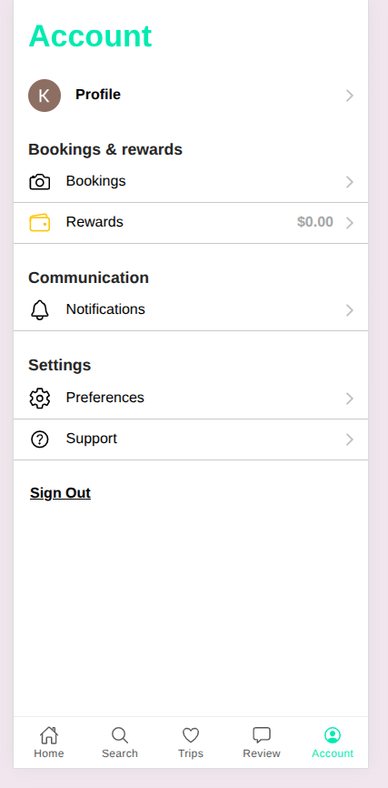

# TripPlan – Your AI Travel Itinerary Generator

TripPlan is a smart and intuitive travel planner built with **Ionic Angular**. Powered by **AI**, it helps you generate detailed trip itineraries with just a few inputs like destination, trip length, and interests. It also fetches relevant images using the **Pixabay API** to bring your plan to life visually.

---

## 🔗 Live Demo

👉 [Try it now](https://triplan-247f3.web.app/)  
*(Best viewed on mobile or using mobile view in dev tools)*

---

## 🎥 Demo Video


---

<h3>📸 App Screenshots</h3>

<div align="center">
  
  
  <br>
  
  
  
</div>

## 🚀 Features

- 🧠 Generate personalized trip plans using **Gemini AI**
- 📅 Supports date selection with range
- 🖼️ Fetches images for destinations using **Pixabay**
- 🧳 Multi-step trip planning form
- 🧭 Horizontal scrollable card UI with modern design
- 📱 Fully responsive with smooth Ionic experience

---

## 🔧 Tech Stack

- **Framework**: Ionic + Angular
- **Backend**: Gemini AI (API Service)
- **Image API**: Pixabay
- **Styling**: Bootstrap & Ionic Components
- **Storage**: Firebase (optional for saved trips)

---

## 🛠️ Installation

```bash
git clone https://github.com/kethirabalan/triplan.git
cd triplan
npm install
ionic serve
